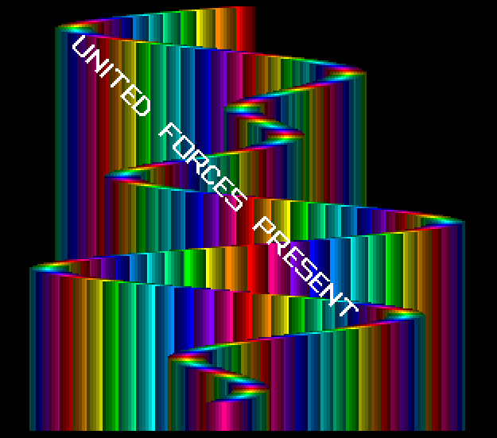

# UNITED FORCES INTRO
## An Amiga Intro Disassembly

This is the disassembled and slightly modernized version
of an Amiga intro by [United Forces](https://demozoo.org/groups/3222/),
released in 1991.

The disassembly was done using ReSource V6.06 on an emulated
Amiga. Further editing and testing was done using
[Visual Studio Code](https://code.visualstudio.com/) with the
[Amiga Assembly](https://github.com/prb28/vscode-amiga-assembly)
extension.

## Inner Workings

The intro is interesting because it uses a single line of 6 bitplanes
in memory to create a continuous stream of colored lines down the
screen. It creates an image with 64 colors and the timing of the
bitplane modification on the original 68000 is so tight that it is
sort of "racing the beam", keeping up with the screen update on the
monitor.

## The Code

The disassembly was not done to the last bit and I might have
misunderstood certain functions of the code, so bear with me.
The intro assembles in VS Code and works in the supplied form.

The following changes were done to the code:
* Added the modern
  [startup.i code](https://github.com/MK1Roxxor/MiniStartup)
  by StingRay.
* Removed restoring the system display that is now handled
  by startup.i.

## References

* [Demozoo](https://demozoo.org/productions/263984/)
* [Pouet](https://www.pouet.net/prod.php?which=14748)
* [Kestra BitWorld](http://janeway.exotica.org.uk/release.php?id=27299)

## Author
MnemoTroN / Spreadpoint, 2024-04-02
